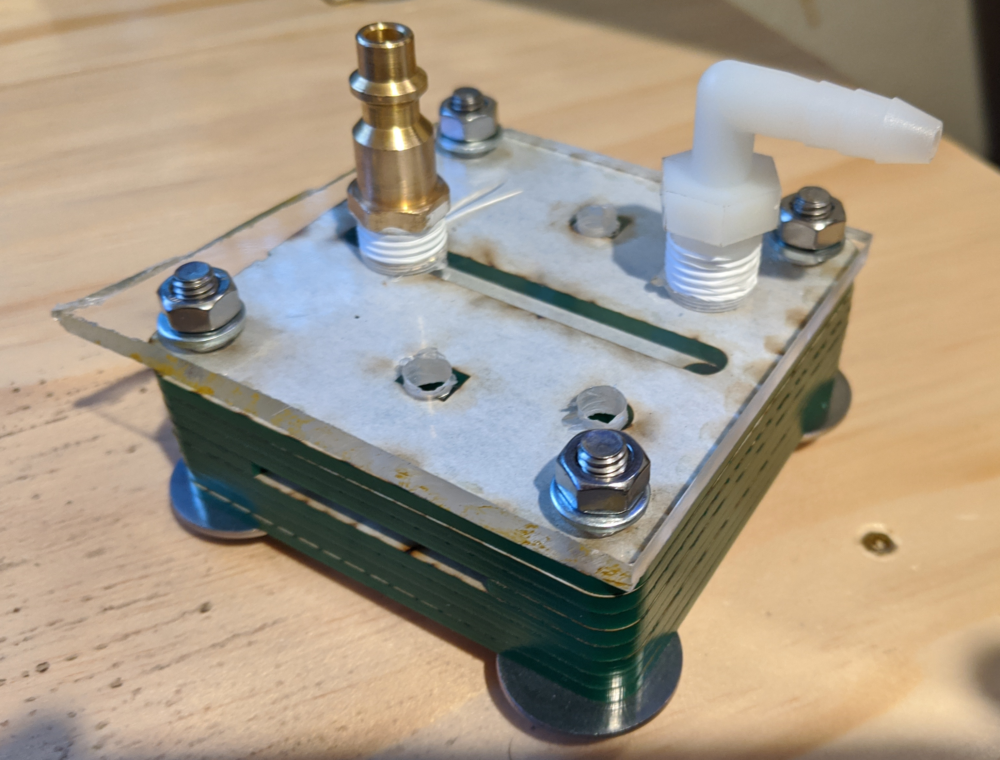
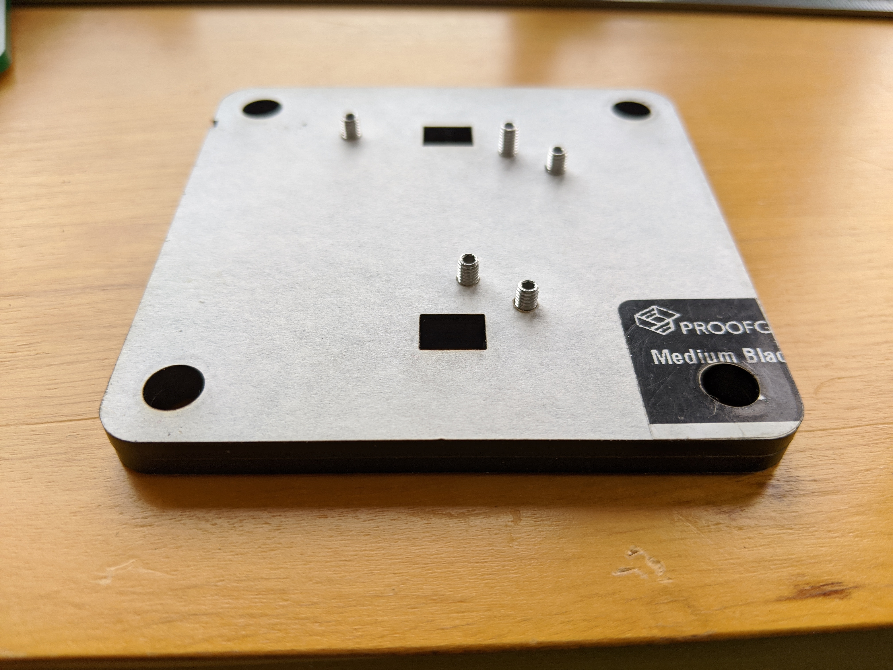
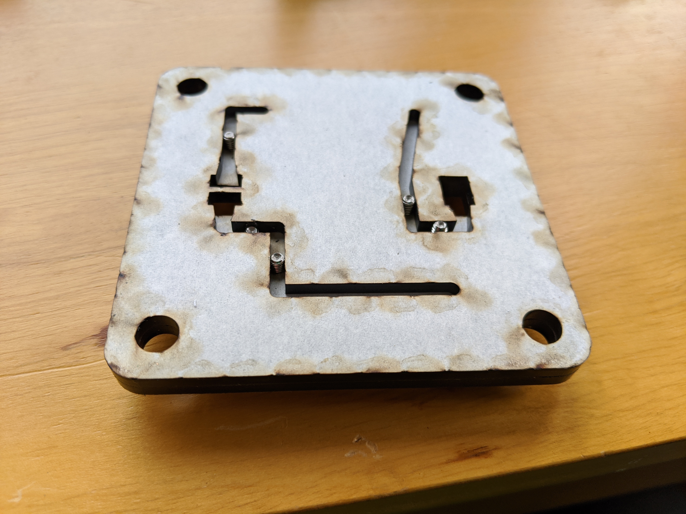

# Manufacturable Ventilator

This is a prototype design for a highly manufacturable ventilator. The ventilator has no moving parts and can be manufactured by cutting, milling, molding, casting, or pressing parts.

## Construction

The prototypes were cut from 1/8" cast acrylic sheets on a laser cutting machine. The master file `ventilator2.svg` is an Inkscape file with a number of layers. Each part is made by combining one of the layers with the `plate` layer. Each part is 80mm by 80mm. The `test plate` layer isn't part of the ventilator; it can be used to test the basic function of an amplifier.

The top two plates were temporarily bolted together, and the 5 resistor holes were tapped with an M3 tap.

A base plate for the supply and patient connections was cut by hand from 3/8" plexiglass. 1/4" holes were drilled for the bolt holes, over the vents, and over the expiration hole. 7/16" holes were drilled over the supply distribution line and the patient connection. The supply and patient connections were tapped with a 1/4" NPT tap. A 1/4" quick air hose disconnect was screwed into the supply hole with teflon tape. A 1/4" inner diameter plastic tubing connector was screwed into the patient hole with teflon tape.

The plates are stacked together and bolted together with 40mm M6 bolts, nuts, and 12mm diameter washers. The bolts are tightened wrist-tight. The sides of the parts are indexed so that one can quickly check that it's been assembled correctly.  The indexed indentations should form a diagonal.

The top plate takes M3 set screws, at least 4 mm long. One set screw is screwed into each of the 5 tapped holes in the plate.

## Operation

[Video of ventilator operating](https://www.youtube.com/watch?v=YwH6RFpGBYY)

Card stock was added in between the resistor gasket and the comparator amplifier to block the amplifier vents from affecting the resistor vent pressure, and below the power amplifier.

The ventilator was connected to a pressure regulated supply, nominally 3 psi, and attached to a test lung. The test lung had a nominal compliance of 20 mL/cm H20.

All of the set screws were inserted all the way, increasing all resistances to their maximum. The four set screws on the two comparator inputs were cracked open, about a quarter of a turn. The resistor between expiration and control was opened until inpsiration started. The resistor between patient control and vent was opened until insipiration ended at a high pressure. The resistor between expiration and control was adjusted to set the pressure where inspiration starts. Also lots of tinkering and fiddling around was done.

The pressure recovery to the patient was low, about 20 cm H20. The supply pressure was increased until the pressure recovered to the patient filled the test lung, which happened at 8 psi supply pressure. The set screws resistances were adjusted again.

Outside view of the operating resistor settings (10mm set screws)

Inside view of the operating resistor settings 

## Design

The ventilator is made from two bistable fluidic amplifiers: a comparator amplifier and a patient amplifier.

The patient amplifier either delivers air to the patient (inspiration) or allows them to exhale (expiration). It's controlled by the comparator amplifier.

The comparator amplifier has two outputs, an inspiration output and an expiration output, which control the inputs of the patient amplifier. It compares two control signals, and if the difference between the two is larger than its switching pressure, it switches to the other output.

A pair of potentiometers calculate the two control signals to the comparator amplifier. One signal is a fraction of the current patient pressure, and the other is a fraction of the expiration output.

The comparator amplifier switches to expiration when the fraction of the patient pressure signal is larger than its switching pressure.

It switches to inspiration when the fraction of the expiration output pressure is larger than the fraction of the patient pressure plus the amplifier's switching pressure.

### Fluidic amplifier design

The amplifier design was calculated using [fluidic-amplifiers](https://github.com/Cedev/fluidic-amplifiers) to have a pressure recovery great enough to deliver 3.5 kPa to the patient.

It nominally operates with a supply pressure of 21 kPa and a control pressure of 2.1 kPa.

The amplifiers nominally have a switching pressure of 0.1 times the supply pressure, and a gain of 1.6.

The thickness of the patient amplifier plate must be enough to deliver addequate flow to the patient. The design was calculated to deliver a ballpark flow using available 1/8" cast acrylic stock.

Rudimentry testing of an amplifier with a supply pressure of 3 psi resulted in 38 cm H20 of pressure recovery to the active output and 2 cm H20 of pressure to the inactive output.

## Background materials

[An evaluation of a Fluid Amplifier, Face Mask Respirator](https://apps.dtic.mil/dtic/tr/fulltext/u2/623457.pdf) page 309

[Image of 1965 army emergency respirator](https://agentgallery.com/objects/rare-1965-prototype-harry-diamond-labs-respirator)

For fluidic amplifier background materials, see [fluidic-amplifiers](https://github.com/Cedev/fluidic-amplifiers#background-material)

----

Shield: [![CC BY 4.0][cc-by-shield]][cc-by]

This work is licensed under a [Creative Commons Attribution 4.0 International
License][cc-by].

[![CC BY 4.0][cc-by-image]][cc-by]

[cc-by]: http://creativecommons.org/licenses/by/4.0/
[cc-by-image]: https://i.creativecommons.org/l/by/4.0/88x31.png
[cc-by-shield]: https://img.shields.io/badge/License-CC%20BY%204.0-lightgrey.svg
